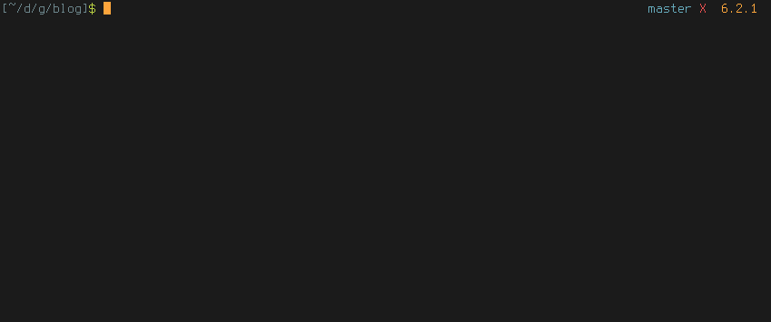

# clg - command line goodness

I love static site generators. I also love the command line. With this project, I aim to make the former a smoother experience on the latter.



## Motivation and state of the project

For several months, I used [hexo](https://hexo.io) for generating a static blog. Just dropping markdown files in folders and generating a blog out of it is great, but when I wanted to edit existing files, it got a little annoying sometimes to have to look for them on the command line.

I was constantly just opening `vim` and using file search plugins to find my posts and that didn't feel right. So I wrote [hexo-cli-extras](https://github.com/greg-js/hexo-cli-extras), which plugged into the hexo database and enhanced (imo) the command-line blogging experience.

The other day I wanted to play with [metalsmith](https://github.com/metalsmith/metalsmith), but I found myself sorely missing my hexo plugin. So I just wrote a [simpler, filesystem-based version of it for metalsmith](https://github.com/greg-js/metalsmith-hammer). But then I realized all static generators kind of work in the same way. If I'm desperate for this kind of feature, then I'm sure other people out there might like it. Hence this package.

I only started writing this yesterday so the project is obviously still in its early stages. But the basic feature of editing static files on the command-line works. I've tested it briefly on `hexo`, `jekyll`, `metalsmith`, `octopress` and `wintersmith`, but there's no reason why it would fail in other Node or Ruby based static site generators as long as you configure the settings right.

If you wanted to, you could even place a `.clg.json` file in any project root and change the settings to use it for editing `js` or `less` or any other files using this approach. Still, the main goal is smooth management of static site files.

## Installation

```
npm install -g clg
```

This is a global package and you only need to install it once.

Read [this](https://github.com/sindresorhus/guides/blob/master/npm-global-without-sudo.md) or install [nvm](https://github.com/creationix/nvm) if you find you need `sudo`.

## tl;dr

`clg` only works in directories that are checked into `git` (it's fine if your git repo is local-only) and are associated with a static site generator.

Running `clg edit` anywhere within such a git repo will give you a list of all markdown files in the `./src` and/or `./source` directories. Select one and it will open in your $EDITOR. If you don't have this environment variable or if you run `clg edit` with `-g`/`--gui`, the file will open in the associated GUI program instead (ie, Atom or Sublime or whatever).

Renamed your `src` directory? Use the `-s`/`--source` option or drop a `.clg.json` file in your project root dir and put this in it:

```
{
  "sourceDirs": [ "your_source_directory" ]
}
```

Not writing in markdown? Add `"types": "your_favorite_file_extension"` (strings overwrite the default settings, arrays concatenate with the defaults) to `.clg.json` or use the `type` option on the command-line.

Filter your clg queries with regular expressions like this: `clg edit search term`. Now only articles will pop up in the menu that contain `/search/` and `/term/`. Only care about files in your `posts` collection? Just add `-d posts` to your query (`--dir` or `--directory works too`).

## `clg edit`

The core and for now only feature of `clg` is `edit`. This is what happens when you run `clg edit` somewhere in your file system:

- The root directory of the project is identified and checked for the inclusion of a static site generator
- If it exists, a project-specific `.clg.json` overwrites the default configuration settings (see below)
- All files that match both your query and the configuration settings are displayed in a menu and you choose the one you want to edit
- The selected file opens in your `$EDITOR` or associated GUI program

### Default settings and `.clg.json`

These are currently the default settings:

```
{
  "sourceDirs": [
    "src",
    "source",
    "_posts",
    "blog"
  ],
  "types": [
    "md",
    "markdown"
  ],
  "supported": [
    "hexo",
    "jekyll",
    "metalsmith",
    "octopress",
    "wintersmith"
  ]
}
```

You can overwrite (use a string, separated by whitespace or commas) or add to (use an array) these default settings on a project-by-project basis by including a `.clg.json` file in your project's root directory.

- `sourceDirs`: An array (or comma-or-whitespace separated string) of top-level directories you want to edit files in. For example, you may want to add `layouts` or `partials` here if you want to use `clg` to edit files in those directories.
- `types`: The filetypes to look for
- `supported`: `clg` will error out unless it detects any of these in the project's `package.json` or `Gemfile.lock`

Here's an example of a project's `.clg.json`, which will make it work on any Node or Ruby project and look exclusively in the `layouts` directory for `ejs`, `md` and `markdown` files:

```
{
  "sourceDirs": "layouts",
  "types": [ "ejs" ],
  "supported": ""
}
```

### `edit` options

As noted earlier, `clg edit` will present you with a list of *all* files located somewhere within the `sourceDirs` dirs that match the `types`.

Fine-tune your query by using any or all of the following:

- regular expressions: every word that isn't an option will be treated as a regular expression to filter the files on. Right now, just the filenames are taken into consideration
- `-s`/`--source`: explicitly specify a single source directory
- `-d`/`--dir`/`--directory`: you probably have subfolders in your source director{y,ies}. Select only a specific subdirectory by using this option
- `-t`/`--type`: specify a file extension. In effect this overwrites your `types` for a single query

Examples:

```
clg edit
clg edit cool post
clg edit -d articles
clg edit -t html
clg edit app -d scripts -t js
```

## Todo

* implement more commands - `rename`, `delete`, `new`
* allow searching and filtering on file content
* tests
